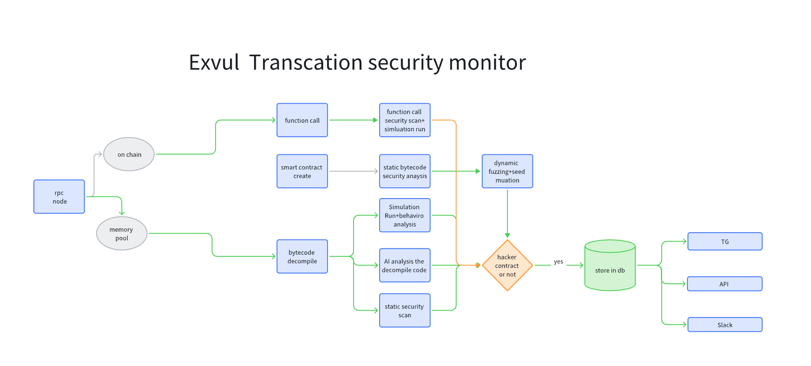

## Exvul on chain TX Security Monitor and Detector

**Project Description**

Exvul TX Security monitor and detector offers comprehensive protection against on-chain threats with a suite of advanced monitoring and analysis tools. Its key features focus on proactive threat detection and rapid response, minimizing the impact of malicious activities.

**Key Features**

1. **Monitoring On-Chain Malicious Contract Creation:**

Exvul employs a multi-layered approach to identify malicious contracts at their inception:

   * **Bytecode Analysis:** Newly created contract bytecode is thoroughly analyzed to identify suspicious patterns and potential vulnerabilities.
   * **AI-Assisted and Self-Developed Decompilation Engines:** These engines reconstruct source code from bytecode, providing a clearer understanding of the contract's logic and facilitating deeper analysis.
   * **Automated Analysis:** This automation streamlines the identification of malicious behavior, enabling rapid detection and response.
   * **Dynamic Fuzzing Technology:** This technique executes the contract with various inputs to uncover hidden vulnerabilities and capture its dynamic behavior, ensuring comprehensive coverage.

By combining these techniques, Exvul can accurately pinpoint malicious contracts created by attackers and promptly notify project teams, preventing potential exploits and safeguarding user funds.

2. **Monitoring Contract Calls:**

Exvul extends its protection to deployed contracts and established projects:

   * **Self-Developed Local Simulated EVM Execution:** This feature allows for safe and controlled execution of contract calls, enabling the detection of malicious behavior without impacting the live blockchain.
   * **Static Analysis:** This technique analyzes the contract's code without executing it, identifying potential vulnerabilities and security flaws.

This combined approach enables rapid identification of attack targets and precise pinpointing of vulnerability root causes, empowering projects to mitigate risks, minimize losses, and even proactively prevent attacks.

3. **Memory Pool Security Monitoring:**

Exvul provides real-time monitoring of the memory pool:

   * **Memory Pool Data Acquisition:** Exvul captures incoming transaction data within the memory pool.
   * **Contract Analysis and Scanning:** Contracts interacting with transactions in the memory pool are analyzed and scanned for potential threats.
   * **Parallel and Rapid Simulated Execution and Static Scanning:** These techniques are applied to quickly assess the risk associated with each transaction.

This proactive monitoring allows for the rapid detection of abnormal transactions and provides crucial early warning signals, enabling preemptive action to prevent potential attacks before they are confirmed on the blockchain.

4. **Abnormal Funds Monitoring:**

Exvul tracks and analyzes fund movements to identify suspicious activity:

   * **Address Tracing:** Exvul follows the flow of funds across different addresses to uncover connections and patterns indicative of malicious activity.
   * **Contract Monitoring:** Ongoing monitoring of contract interactions helps identify unusual or suspicious transactions.
   * **Associated Address Analysis:** By analyzing relationships between addresses, Exvul can identify potential attacker networks and uncover hidden connections.

This comprehensive approach to funds flow analysis allows for the discovery of hacker addresses and other suspicious entities, providing valuable intelligence for investigations and preventative measures.

**Architecture**

> **Note:** Due to limitations of Lark documents, framework information cannot be displayed here.

**Alert Information Pushed By:**

* Telegram
* API
* Slack
